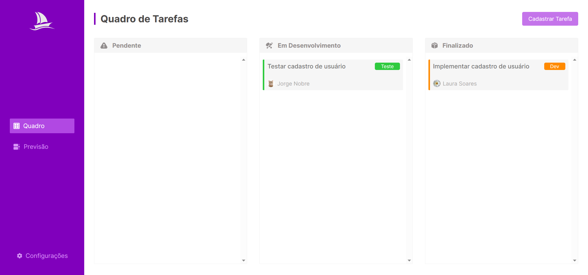

<h1 align="center" style="margin-bottom: 2rem;">Tasker</h1>

### 🏆 Sobre o projeto:

Aplicação de gerência de tarefas desenvolvida totalmente com HTML 5, CSS 3 e JS 
sem utilização de framework afim de aprofundar conhecimentos nativos nessas tecnologias. 
Neste projeto, utilizou-se diversos eventos do JS para fazer ações como mostrar, esconder,
arrastar e soltar elementos HTML.

### ⭐️ Funcionalidades:

- Cadastro de tarefas
- Atualização de tarefas
- Remoção de tarefas
- Listagem de tarefas
- Movimentação de cards entre diferentes quadros utilizando eventos de arrastar e soltar